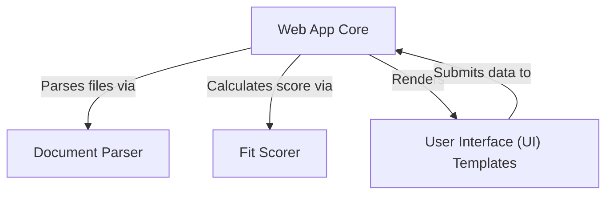
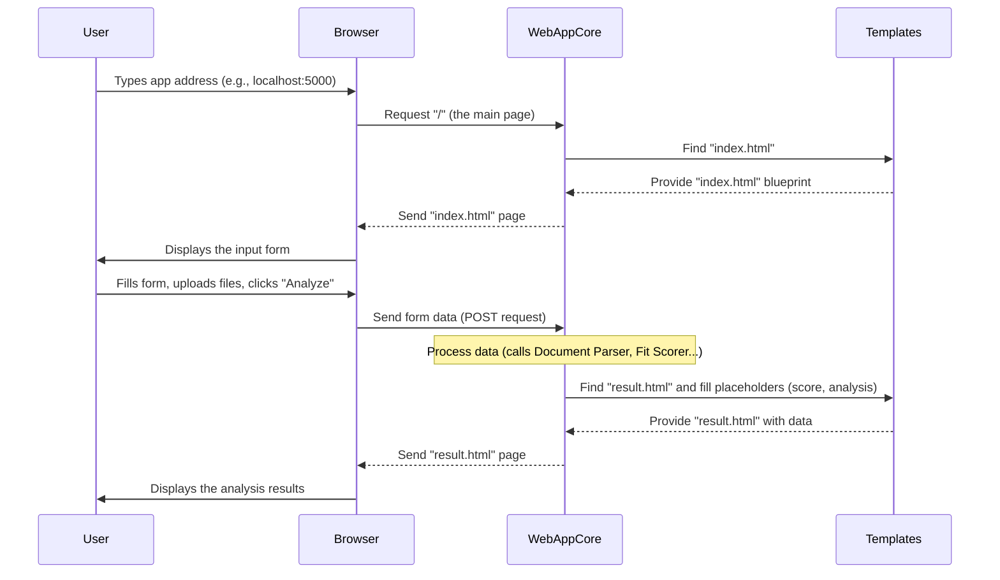
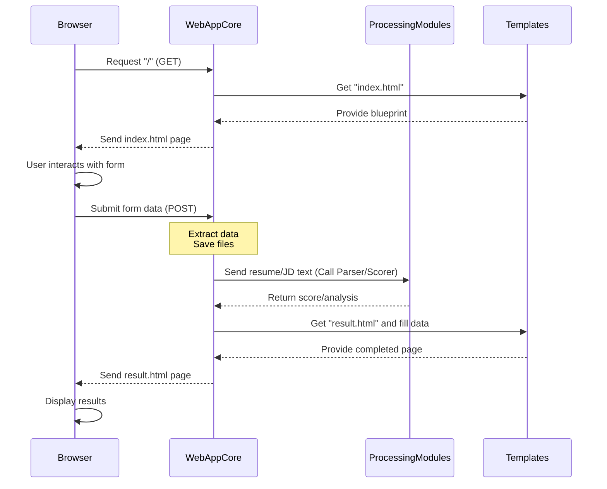
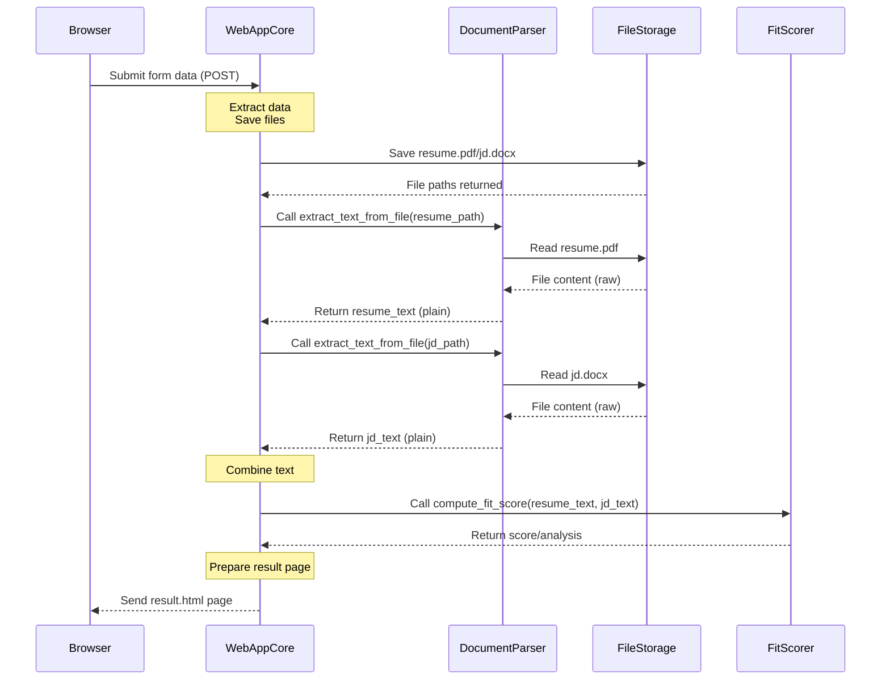
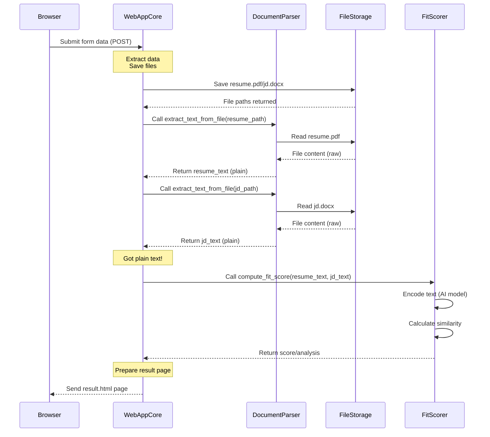

# Tutorial: Resume-Screener-App

This project is a **Resume Screener Web App**. It lets you upload your *resume* and a *job description*. The app then uses **AI** to calculate a *match score* showing how well your resume fits the job. Finally, it displays the *score* and some *tips* on a webpage to help you improve.


## Visual Overview



# Project Documentation Overview

## 1. User Interface Templates 

## 2. Web App Core Logic  

## 3. Resume Document Parser  

## 4. Fit Scoring Engine  

---

# Chapter 1: User Interface (UI) Templates

Welcome to the first chapter of the Resume Screener App tutorial! We're going to start by looking at the part of the application you actually see and interact with: the User Interface, or UI.

### What Problem Are We Solving?

Imagine you want to use our Resume Screener App. How do you tell it which resume and job description you want to use? And once the app does its magic, how does it show you the result? This is where the User Interface comes in.

Think of the app as a kitchen. You're outside the kitchen wanting a meal. The UI is like the restaurant's dining area, the menu, and the waiter. You use the menu to tell the kitchen what you want, and the waiter brings the finished meal to your table. You don't need to see the chopping, frying, and cooking happening in the kitchen (the "behind-the-scenes processing").

In our web application, the "dining area" and "menu" are the web pages you see in your browser. These web pages are built using something called **UI Templates**.

### What Are UI Templates?

UI Templates are essentially the blueprints for your web pages. They are files that define the layout, text, images, forms, and where dynamic information should appear on a page.

In web development, these templates are often written in HTML (HyperText Markup Language), sometimes with CSS (Cascading Style Sheets) to make them look nice, and a bit of JavaScript for interactive bits.

They handle the **presentation layer**. This means they show things to the user and allow the user to provide input, but they don't do the heavy computation or processing themselves.

For our Resume Screener App, we have two main UI Templates:

*   **`index.html`**: This is the template for the main page where you upload your resume, job description, and enter details. It's your "order form."
*   **`result.html`**: This is the template for the page that shows you the calculated score and analysis after the app has processed your files. It's your "meal delivered to the table."

Let's look at these templates. You can find them in the `templates` folder in the project.

### The Input Page: `index.html`

The `index.html` file is the first page you see. It contains a form for you to provide the necessary information.

Here's a simplified look at the key parts of the `index.html` template:

```html
<!DOCTYPE html>
<html lang="en">
<head>
    <meta charset="UTF-8">
    <title>QualifAI</title>
    <!-- CSS and other header stuff -->
</head>
<body>
    <div class="page-container">
        <div class="container">
            <div class="header">
                <h1>QualifAI-Resume Screener</h1>
                <p class="tagline">Upload your resume and get instant feedback</p>
            </div>

            <!-- The Form Starts Here -->
            <form method="POST" enctype="multipart/form-data" class="form-card">
                <!-- Section for uploading Resume file -->
                <div class="form-section">
                    <label for="resume">Upload Resume (PDF/DOCX):</label>
                    <input type="file" name="resume" id="resume" required>
                </div>

                <!-- Section for uploading Job Description file -->
                <div class="form-section">
                    <label for="jd_file">Upload Job Description (optional):</label>
                    <input type="file" name="jd_file" id="jd_file">
                </div>

                <!-- Section for pasting Job Description text -->
                <div class="form-section">
                    <label for="jd_text">Or Paste Job Description:</label>
                    <textarea name="jd_text" id="jd_text" rows="6" placeholder="Paste the job description here..."></textarea>
                </div>

                <!-- Section for entering Job Title -->
                <div class="form-section">
                    <label for="job_title">Job Title:</label>
                    <input type="text" name="job_title" id="job_title" placeholder="e.g., Data Scientist">
                </div>

                <!-- The Submit Button -->
                <button type="submit" class="submit-btn">
                    <span>Analyze Resume</span>
                </button>
            </form>

            <!-- Footer -->
            <div class="footer">
                <p>Get instant feedback...</p>
            </div>
        </div>
    </div>
    <!-- JavaScript for file upload name display -->
</body>
</html>
```

This HTML code defines the structure of the page.
*   It has sections for uploading files (`<input type="file">`).
*   It has a section for typing or pasting text (`<textarea>`).
*   It has a section for typing a single line of text (`<input type="text">`).
*   Crucially, it has a `<form>` tag with `method="POST"`. This tells the browser to collect all the input values when the button inside the form is clicked and send them to the server for processing.

When you visit the app's main address in your browser, this `index.html` template is what you will see. You'll use the fields on this page to give the app the information it needs to start the screening process.

### The Output Page: `result.html`

After you submit the form on the `index.html` page, the application processes your request. Once it's done, it needs to show you the results. This is the job of the `result.html` template.

Here's a simplified look at `result.html`:

```html
<!DOCTYPE html>
<html lang="en">
<head>
    <meta charset="UTF-8">
    <title>QualifAI</title>
    <!-- CSS and other header stuff -->
</head>
<body>
    <div class="page-container">
        <div class="container result-container">
            <div class="header">
                <h1>Resume Analysis</h1>
            </div>

            <div class="result-card">
                <!-- Displays the Job Title -->
                <div class="job-title">
                    <h2>{{ job_title }}</h2>
                </div>

                <!-- Displays the Score -->
                <div class="score-container">
                    <div class="score-circle" data-score="{{ score }}">
                        <div class="score-number">{{ score }}%</div>
                        <div class="score-label">Match</div>
                    </div>
                </div>

                <!-- Displays the Analysis -->
                <div class="analysis-section">
                    <h3>Analysis</h3>
                    <div class="analysis-card summary">
                        <h4>Summary</h4>
                        <p>{{ details.summary }}</p>
                    </div>

                    <div class="analysis-card tips">
                        <h4>Improvement Tips</h4>
                        <p>{{ details.tips }}</p>
                    </div>
                </div>

                <!-- Button to go back -->
                <a href="/" class="back-btn">
                    <span>Try Another Resume</span>
                </a>
            </div>

            <!-- Footer -->
            <div class="footer">
                <p> &copy; 2025 QualifAI...</p>
            </div>
        </div>
    </div>
    <!-- JavaScript for score circle animation -->
</body>
</html>
```

Notice the parts enclosed in double curly braces, like `{{ job_title }}`, `{{ score }}`, `{{ details.summary }}`, and `{{ details.tips }}`. These are special placeholders. The template itself doesn't know the job title or the score.

Before the application sends this page to your browser, the **Web App Core** (which we'll talk about in the next chapter) fills in these placeholders with the *actual* job title you entered, the calculated score, the summary analysis, and the tips. This is why they are called "templates" – they are a pattern that the application fills with data.

This page shows you the results of the analysis in a clear, organized way, and provides a button to go back to the input page.

### How Templates Fit In the Big Picture

So, how do these templates work together with the rest of the application? Let's look at a simplified flow:



As you can see, the templates are used by the Web App Core to generate the HTML pages that the browser displays to the user. They are the "face" of the application, presenting information and collecting input. They don't handle the complex logic of reading files or calculating scores – that's the job of other parts of the application.

### Conclusion

In this chapter, we learned about the User Interface (UI) Templates in the Resume Screener App. These are the HTML files (`index.html` and `result.html`) that define what the user sees in their browser – the forms for input and the pages for displaying results. They are the presentation layer, acting like the front end of a store where customers interact, while the real work happens behind the scenes.

In the next chapter, we'll dive into the [Web App Core](02_web_app_core_.md), which is the central part of the application that receives requests from the browser, uses the templates, and coordinates the other components to perform the actual screening and analysis.

[Next Chapter: Web App Core](02_web_app_core_.md)

---
# Chapter 2: Web App Core

Welcome back! In the previous chapter, [User Interface (UI) Templates](01_user_interface__ui__templates_.md), we looked at the face of our application – the web pages (`index.html` and `result.html`) that you see and interact with in your browser. These templates are like the menu and dining area of a restaurant, showing you what's available and collecting your order.

But who takes your order, tells the kitchen what to cook, waits for the meal, and brings it back to your table? That's where the **Web App Core** comes in.

### What Problem Does the Web App Core Solve?

The internet works by your browser sending requests to a server, and the server sending back responses. When you type a website address or click a link, your browser is sending a request. When you see a page load, that's the server's response.

Our Resume Screener App is a web application, meaning it lives on a server and talks to your browser. The Web App Core is the part of the application that's responsible for this communication. It's like the central brain that handles everything happening on the "web" side.

Think of it as the **receptionist** at an office building:

*   Someone arrives (your browser sends a **request**).
*   The receptionist greets them, asks who they are and why they're here (identifies the request, like asking for the main page or submitting a form).
*   The receptionist directs them to the right department or person (calls the correct functions or components to handle the request).
*   The receptionist might receive information or a package from that department.
*   Finally, the receptionist provides information or directs the visitor out (sends a **response** back to your browser).

The Web App Core's main job is to listen for requests from the web and figure out how to respond correctly.

### Receiving Requests and Sending Responses

At its heart, the Web App Core is all about handling **HTTP requests** and sending back **HTTP responses**. HTTP is the language web browsers and servers use to talk to each other.

*   **HTTP Request:** Your browser asks the server for something (e.g., "Give me the page at '/'", "Here is the data from the form on the '/' page").
*   **HTTP Response:** The server sends something back (e.g., the HTML code for a web page, a confirmation message).

The Web App Core uses a special tool called a **web framework** to make handling these requests easier. Our application uses a popular Python web framework called **Flask**. Flask helps us define which function in our Python code should run when a specific web address (URL) is requested.

### Handling the User's Journey

Let's trace the journey of a user using the Web App Core, from arriving at the site to seeing their results:

1.  **User requests the main page:** The user types the app's address (like `localhost:5000`) in their browser.
2.  **Browser sends GET request:** The browser sends a `GET` request to the server at the address `/` (the root, or main, path).
3.  **Web App Core receives GET request:** The Web App Core, using Flask, sees a `GET` request for `/`. It knows it needs to show the input form.
4.  **Web App Core uses the template:** It finds the `index.html` [User Interface (UI) Templates](01_user_interface__ui__templates_.md) and prepares it to be sent.
5.  **Web App Core sends response:** It sends the `index.html` page back to the browser.
6.  **Browser displays the form:** The user sees the input page.
7.  **User fills form and submits:** The user uploads files, types text, and clicks the "Analyze Resume" button.
8.  **Browser sends POST request:** The browser collects all the form data (files, text) and sends a `POST` request to the server, again often to the same `/` address. `POST` is used when you're sending data to the server, like submitting a form.
9.  **Web App Core receives POST request:** The Web App Core sees a `POST` request for `/`. It knows it has received data that needs processing.
10. **Web App Core processes the data:** This is where the core logic happens:
    *   It extracts the uploaded files and text from the request.
    *   It saves the files temporarily.
    *   It calls the [Document Parser](03_document_parser_.md) to read text from the files.
    *   It calls the [Fit Scorer](04_fit_scorer_.md) with the resume text and job description text to calculate a score and get analysis details.
11. **Web App Core prepares result:** It receives the score and details from the [Fit Scorer](04_fit_scorer_.md).
12. **Web App Core uses the result template:** It finds the `result.html` [User Interface (UI) Templates](01_user_app_core_.md) and fills in the placeholders (`{{ score }}`, `{{ details }}`, etc.) with the actual data received from the processing steps.
13. **Web App Core sends response:** It sends the completed `result.html` page back to the browser.
14. **Browser displays the result:** The user sees the analysis results page.

### How It Looks in Code (`app.py`)

Let's look at the core Python file, `app.py`, to see how the Web App Core is implemented using Flask.

First, we set up the Flask application:

```python
from flask import Flask, render_template, request, redirect
from werkzeug.utils import secure_filename
import os
# We'll talk about these imports later!
from utils.parser import extract_text_from_file
from utils.scorer import compute_fit_score

# Create a Flask application instance
app = Flask(__name__)
# Configure where to temporarily save uploaded files
app.config['UPLOAD_FOLDER'] = 'app/uploads'
# Ensure that upload folder exists
os.makedirs(app.config['UPLOAD_FOLDER'], exist_ok=True)
```
This code imports necessary libraries (including Flask), creates the main `app` object, and sets up a place to save files uploaded by the user.

Now, let's look at the part that handles requests. The `@app.route('/')` line tells Flask that the function right below it should run when someone requests the `/` path of our website.

```python
@app.route('/', methods=['GET', 'POST'])
def index():
    # This function handles both GET (showing the form)
    # and POST (processing the form submission) requests for the '/' path
    # ... (rest of the function below)
    pass # This is just a placeholder
```
This is the main function for our app's core logic. The `methods=['GET', 'POST']` part means this one function can handle both types of requests coming to the `/` address.

Inside this function, we check what *type* of request it is:

```python
@app.route('/', methods=['GET', 'POST'])
def index():
    # Check if the request is a POST request (meaning the form was submitted)
    if request.method == 'POST':
        # --- Code to handle form submission goes here ---
        # Get data from the submitted form
        resume_file = request.files['resume']
        jd_file = request.files.get('jd_file')
        jd_text = request.form.get('jd_text')
        job_title = request.form.get('job_title')

        # ... (rest of the POST handling logic)

    # If the request is NOT POST (it's likely GET), show the input form
    return render_template('index.html')
```
If `request.method` is `'POST'`, it means the user submitted the form. We then use `request.files` to get the uploaded files and `request.form` to get the text inputs (like job title or pasted JD).

If it's not a `POST` request (usually a `GET` request when the user first arrives), the code skips the `if` block and goes straight to the `return render_template('index.html')`. This uses the `render_template` function from Flask to load and send the `index.html` [User Interface (UI) Templates](01_user_interface__ui__templates_.md) to the user's browser.

Let's look closer at the `POST` handling inside the `if request.method == 'POST':` block:

```python
@app.route('/', methods=['GET', 'POST'])
def index():
    if request.method == 'POST':
        # Get form data (already shown above)
        resume_file = request.files['resume']
        jd_file = request.files.get('jd_file')
        jd_text = request.form.get('jd_text')
        job_title = request.form.get('job_title')

        # --- Process the uploaded files and text ---
        resume_text = "" # Initialize text variables
        jd_content = ""

        if resume_file:
            # Securely save the uploaded resume file
            resume_path = os.path.join(app.config['UPLOAD_FOLDER'], secure_filename(resume_file.filename))
            resume_file.save(resume_path)
            # Use the Document Parser to extract text
            resume_text = extract_text_from_file(resume_path) # Link to [Document Parser](03_document_parser_.md)

        if jd_file and jd_file.filename != '':
            # Securely save JD file if provided
            jd_path = os.path.join(app.config['UPLOAD_FOLDER'], secure_filename(jd_file.filename))
            jd_file.save(jd_path)
            # Use the Document Parser to extract text
            jd_content = extract_text_from_file(jd_path) # Link to [Document Parser](03_document_parser_.md)
        elif jd_text:
             # Or use pasted text if provided
            jd_content = jd_text

        # --- Call the Fit Scorer and render the result ---
        if resume_text and jd_content:
            # Call the Fit Scorer with the extracted text
            score, match_details = compute_fit_score(resume_text, jd_content) # Link to [Fit Scorer](04_fit_scorer_.md)
            # Render the result template, passing the score and details
            return render_template('result.html', score=round(score * 100, 2), details=match_details, job_title=job_title) # Link to [User Interface (UI) Templates](01_user_interface__ui__templates_.md)
        else:
            # Handle cases where needed data is missing (basic error)
            return "Please upload both Resume and Job Description."

    # Handles GET request: show the initial form
    return render_template('index.html')
```
This section shows the core workflow when the form is submitted:
1.  It gets the data from the `request`.
2.  It saves the files using `save()`. Note the use of `secure_filename` for safety (a detail we won't fully explain, but it's good practice!).
3.  It calls `extract_text_from_file` (from the [Document Parser](03_document_parser_.md) module) to get readable text from the resume and JD files (or uses the pasted JD text).
4.  If it successfully gets both resume text and JD content, it calls `compute_fit_score` (from the [Fit Scorer](04_fit_scorer_.md) module) to get the score and analysis details.
5.  Finally, it calls `render_template('result.html', ...)` (using the `result.html` [User Interface (UI) Templates](01_user_interface__ui__templates_.md)) and passes the calculated `score`, `details`, and the `job_title` to the template. Flask fills in the `{{ placeholders }}` in the template with these values. The resulting HTML page is then sent back to the browser.

If somehow it doesn't get both resume text and JD content, it sends a simple error message back.

### The Flow Summarized

Here's a simplified diagram showing how the Web App Core interacts with the browser and other parts of the application:


As you can see, the Web App Core acts as the central coordinator. It receives everything from the browser, decides which internal "department" ([Document Parser](03_document_parser_.md), [Fit Scorer](04_fit_scorer_.md)) needs to do work, passes them the necessary information, gets the results back, and finally uses the [User Interface (UI) Templates](01_user_interface__ui__templates_.md) to build the page to send back to the browser.

### Conclusion

The Web App Core is the glue that holds our web application together. It's like the receptionist who manages the flow of visitors and information. Using a framework like Flask, it listens for requests from the browser, determines the user's intention (viewing a page or submitting data), coordinates with other parts of the application (like the parser and scorer), and sends back the correct web page (rendered from our templates) as a response.

Now that we understand how the application handles requests and responses and acts as a central hub, we can look closer at the "departments" it calls upon to do the actual work. In the next chapter, we'll dive into the [Document Parser](03_document_parser_.md), which is responsible for reading text from the uploaded files.

[Next Chapter: Document Parser](03_document_parser_.md)

# Chapter 3: Document Parser

Welcome back! In the previous chapters, we explored the [User Interface (UI) Templates](01_user_interface__ui__templates_.md) (what you see in the browser) and the [Web App Core](02_web_app_core_.md) (the central brain that handles web requests and coordinates everything). We saw how the [Web App Core](02_web_app_core_.md) receives uploaded files from the user.

But the files users upload are typically PDFs or Microsoft Word (`.docx`) documents. These formats are great for reading and printing, but they contain lots of formatting information, images, tables, and other things that make it hard for a simple computer program to just read the raw *words*.

Imagine you have a beautifully formatted resume and a detailed job description document. The next part of our application, the [Fit Scorer](04_fit_scorer_.md), needs to read these documents and understand the *text* inside them to figure out how well they match. It doesn't care about the fancy fonts, the page margins, or where the bullet points are placed. It just needs the plain text content.

### What Problem Does the Document Parser Solve?

This is where the **Document Parser** comes in. Its job is to be a specialized reader. It takes a file, whether it's a PDF or a DOCX, and reads *only* the readable text content, ignoring all the formatting and extra stuff. It then gives you back just a big block of plain text.

Think of the Document Parser as a **translator** or a **scribe**. You give it a document written in a specific, structured language (like PDF or DOCX, which are complex digital languages), and it translates or transcribes it into a simple, universal language that anyone (or any program) can easily understand – plain text.

The core problem it solves is converting structured document formats (PDF, DOCX) into raw, unstructured text that our application's logic can work with.

### How the Web App Core Uses the Parser

Let's revisit a snippet from our [Web App Core](02_web_app_core_.md) in `app.py`. We saw that after saving an uploaded file, the code called a function named `extract_text_from_file`.

```python
# ... inside the index() function, after saving resume_file ...

if resume_file:
    # Securely save the uploaded resume file
    resume_path = os.path.join(app.config['UPLOAD_FOLDER'], secure_filename(resume_file.filename))
    resume_file.save(resume_path)
    # Use the Document Parser to extract text
    resume_text = extract_text_from_file(resume_path) # This calls the parser

# ... similar logic for jd_file ...
```

Here, the [Web App Core](02_web_app_core_.md) has the `resume_path` (the location where the uploaded resume file was temporarily saved). It passes this path to the `extract_text_from_file` function. The parser then does its work and returns the `resume_text` as a string, which is then stored in the `resume_text` variable. This `resume_text` is what will eventually be sent to the [Fit Scorer](04_fit_scorer_.md).

So, from the perspective of the [Web App Core](02_web_app_core_.md), using the parser is simple: you call one function, give it a file path, and get the plain text back.

### Inside the Document Parser (`utils/parser.py`)

Now, let's look "under the hood" at how the `extract_text_from_file` function actually works. You can find this code in the `utils/parser.py` file.

First, the parser needs special tools (libraries) to read PDFs and DOCX files, because these formats are complex.

```python
import fitz  # This library is part of PyMuPDF, used for PDFs
import docx  # This library is 'python-docx', used for .docx files

# The function definition we saw in app.py
def extract_text_from_file(file_path):
    # ... parser logic goes here ...
    pass # Placeholder
```

The function `extract_text_from_file` takes one input: `file_path`. This is a string that tells the function exactly where the file is located on the computer's storage.

The first thing the parser needs to do is figure out *what kind* of file it is, so it knows which specialized tool (library) to use. It does this by looking at the end of the file path, the file extension (`.pdf` or `.docx`).

```python
def extract_text_from_file(file_path):
    # Check if the file path ends with '.pdf'
    if file_path.endswith('.pdf'):
        # --- Logic for reading PDF goes here ---
        text = ""
        # We'll see the PDF reading code next...
        return text
    # Check if the file path ends with '.docx'
    elif file_path.endswith('.docx'):
        # --- Logic for reading DOCX goes here ---
        # We'll see the DOCX reading code next...
        doc = docx.Document(file_path)
        return "\n".join([para.text for para in doc.paragraphs])
    # If it's neither PDF nor DOCX
    else:
        # Return an empty string, as we can't process it
        return ""
```

This shows the basic structure: check the file extension and then branch into different code based on the type. If it's a `.pdf`, it runs the PDF reading code. If it's a `.docx`, it runs the DOCX reading code. If it's something else (like a `.jpg` or `.txt`), it just returns an empty string because the parser doesn't know how to read those formats.

#### Reading PDF Files (`.pdf`)

To read a PDF file, the parser uses the `fitz` library (which is part of PyMuPDF). This library can open the PDF document and go through each page, extracting the text.

```python
def extract_text_from_file(file_path):
    if file_path.endswith('.pdf'):
        text = "" # Start with an empty string to collect text
        try:
            # Open the PDF document using fitz
            with fitz.open(file_path) as doc:
                # Loop through each page in the document
                for page in doc:
                    # Extract text from the current page and add it to our text variable
                    text += page.get_text()
            return text # Return the collected text
        except Exception as e:
            # Handle potential errors during PDF reading
            print(f"Error reading PDF {file_path}: {e}")
            return "" # Return empty text if reading fails
    # ... (elif and else parts for DOCX/other files)
    elif file_path.endswith('.docx'):
        # ... DOCX reading code ...
        pass
    else:
        return ""
```
This code opens the PDF file using `fitz.open()`. It then loops through every `page` in the opened `doc`ument. For each page, it calls `page.get_text()`, which is the function provided by the `fitz` library to pull out the plain text from that specific page. It adds the text from each page to the `text` variable. Finally, after processing all pages, it returns the complete `text` collected from the PDF.

#### Reading DOCX Files (`.docx`)

Reading `.docx` files is similar, but it uses the `docx` library (python-docx) and works slightly differently because DOCX documents are structured into paragraphs.

```python
def extract_text_from_file(file_path):
    # ... (if part for PDF files) ...
    if file_path.endswith('.pdf'):
        # ... PDF reading code ...
        pass
    elif file_path.endswith('.docx'):
        try:
            # Open the DOCX document using the docx library
            doc = docx.Document(file_path)
            # Extract text from each paragraph and join them with newlines
            return "\n".join([para.text for para in doc.paragraphs])
        except Exception as e:
            # Handle potential errors during DOCX reading
            print(f"Error reading DOCX {file_path}: {e}")
            return "" # Return empty text if reading fails
    # ... (else part for other files) ...
    else:
        return ""

```
Here, `docx.Document(file_path)` opens the Word document. A DOCX document is made up of paragraphs, which the `docx` library provides in a list called `doc.paragraphs`. The code then goes through this list, takes the `text` content of each `para`graph (`para.text`), and joins all these paragraph texts together into one big string, separated by newline characters (`\n`) to keep the structure somewhat similar to the original document. This resulting string is returned.

#### The Complete Parser Code

Putting it all together (and adding basic error handling with `try...except` which is good practice), the `utils/parser.py` file looks like this:

```python
import fitz  # PyMuPDF
import docx

def extract_text_from_file(file_path):
    """
    Extracts text from PDF or DOCX files.
    Returns an empty string for other file types or on error.
    """
    if file_path.endswith('.pdf'):
        text = ""
        try:
            with fitz.open(file_path) as doc:
                for page in doc:
                    text += page.get_text()
            return text
        except Exception as e:
            print(f"Error reading PDF {file_path}: {e}")
            return ""
    elif file_path.endswith('.docx'):
        try:
            doc = docx.Document(file_path)
            return "\n".join([para.text for para in doc.paragraphs])
        except Exception as e:
            print(f"Error reading DOCX {file_path}: {e}")
            return ""
    else:
        # File type not supported
        return ""

```
This is the complete logic for our Document Parser. It's a straightforward function that acts as a bridge between structured document files and the plain text needed by the rest of the application.

### How the Parser Fits In the Flow

Let's update our flow diagram from the previous chapter to include the Document Parser:


As you can see, the [Web App Core](02_web_app_core_.md) interacts with the Document Parser *after* saving the file and *before* calling the [Fit Scorer](04_fit_scorer_.md). The parser is a crucial intermediate step, taking the raw file data and converting it into the usable text format.

### Conclusion

In this chapter, we explored the **Document Parser**, the component responsible for reading the content of uploaded PDF and DOCX files and converting it into plain text. We saw how it acts like a translator, using specific libraries (`fitz` for PDF and `python-docx` for DOCX) to handle different file types. The [Web App Core](02_web_app_core_.md) calls the parser function with the file path, and the parser returns the extracted text, which is essential data for the next step in the process.

Now that we have the plain text from both the resume and the job description, the application can finally do the core task: comparing them to see how well they match. In the next chapter, we'll dive into the [Fit Scorer](04_fit_scorer_.md), which takes this plain text and calculates a compatibility score.

[Next Chapter: Fit Scorer](04_fit_scorer_.md)

---
# Chapter 4: Fit Scorer

Welcome back for the final chapter of our Resume Screener App tutorial! So far, we've covered:
*   [Chapter 1: User Interface (UI) Templates](01_user_interface__ui__templates_.md) – what you see and interact with (the forms and results pages).
*   [Chapter 2: Web App Core](02_web_app_core_.md) – the central brain that handles web requests and coordinates everything.
*   [Chapter 3: Document Parser](03_document_parser_.md) – the tool that extracts plain text from PDF and DOCX files.

By the end of Chapter 3, the [Document Parser](03_document_parser_.md) has successfully given the [Web App Core](02_web_app_core_.md) two important pieces of information: the full plain text content of the resume and the full plain text content of the job description.

Now, the application has everything it needs to perform its main task: figuring out how well the resume *fits* the job description.

### What Problem Does the Fit Scorer Solve?

Imagine you have a big pile of text from a resume and another big pile of text from a job description. You need to compare them and produce a single number – a score – that tells you, on a scale of 0% to 100%, how good the match is.

Simply checking if exact words are present isn't enough. A resume might say "Led a team of engineers" while the job description asks for "Experience managing technical staff". These use different words, but the *meaning* is very similar. A smart screener needs to understand this kind of similarity.

This is the job of the **Fit Scorer**. It's the core piece of logic that takes the plain text from the resume and the job description, analyzes their *meaning*, and calculates a similarity score.

Think of the Fit Scorer as a **smart comparison engine**. Instead of just looking for identical words, it tries to understand the *ideas* and *concepts* discussed in both documents and sees how much they overlap. It then gives you a simple percentage to represent that overlap.

### How the Web App Core Uses the Scorer

Let's look again at the snippet from our [Web App Core](02_web_app_core_.md) in `app.py`. After getting the text from the resume and job description (using the [Document Parser](03_document_parser_.md)), the [Web App Core](02_web_app_core_.md) calls a function called `compute_fit_score`:

```python
# ... inside the index() function, after getting resume_text and jd_content ...

if resume_text and jd_content:
    # Call the Fit Scorer with the extracted text
    score, match_details = compute_fit_score(resume_text, jd_content) # This calls the scorer

    # Render the result template, passing the score and details
    return render_template('result.html', score=round(score * 100, 2), details=match_details, job_title=job_title)
# ... (rest of the app.py logic) ...
```

The [Web App Core](02_web_app_core_.md) takes the `resume_text` and `jd_content` (both are just long strings of text) and passes them to the `compute_fit_score` function.

What does `compute_fit_score` give back? It returns two things:
1.  A `score`: This is the raw similarity score (a number, typically between 0 and 1).
2.  `match_details`: This is a dictionary (a collection of key-value pairs) that can contain additional information about the match, like a summary or tips. (In our simple example, this is just placeholder text, but in a more advanced app, this is where detailed feedback would come from).

The [Web App Core](02_web_app_core_.md) then takes the `score` (multiplies it by 100 to get a percentage and rounds it) and the `match_details` and passes them to the `result.html` [User Interface (UI) Templates](01_user_interface__ui__templates_.md) to display them to the user.

So, from the [Web App Core](02_web_app_core_.md)'s point of view, the Fit Scorer is a black box: you put text in, and you get a score and details out. The core comparison logic is hidden inside the scorer.

### Inside the Fit Scorer (`utils/scorer.py`)

Now, let's open up that black box and see how the `compute_fit_score` function works. You'll find this code in the `utils/scorer.py` file.

The Fit Scorer uses a concept from the world of Artificial Intelligence (AI) and Natural Language Processing (NLP). It uses a special **AI model** that has been trained on a massive amount of text to understand the meaning of sentences and paragraphs. This model can convert text into a numerical format that computers can easily compare.

Here's the code for `utils/scorer.py`:

```python
from sentence_transformers import SentenceTransformer, util

# Load the AI model that understands text meaning
# 'all-MiniLM-L6-v2' is a specific pre-trained model name
model = SentenceTransformer('all-MiniLM-L6-v2')

def compute_fit_score(resume_text, jd_text):
    """
    Calculates the semantic similarity score between resume and job description text.
    """
    # Step 1: Convert text into numerical representations (embeddings)
    # The model "encodes" the text into a vector (list of numbers)
    resume_emb = model.encode(resume_text, convert_to_tensor=True)
    jd_emb = model.encode(jd_text, convert_to_tensor=True)

    # Step 2: Calculate the similarity between the numerical representations
    # Cosine similarity measures the angle between the vectors - closer means more similar meaning
    score = util.cos_sim(resume_emb, jd_emb).item()

    # Step 3: Provide (dummy) analysis details
    # In a real app, this would be more sophisticated
    match_details = {
        'summary': 'Your resume has been compared to the job description using Sentence-BERT (the AI model).',
        'tips': 'To improve your match, review the job description and make sure relevant skills and experiences are clearly mentioned in your resume, using similar phrasing where appropriate.'
    }

    # Step 4: Return the score and details
    return score, match_details

```

Let's break this down step-by-step:

1.  **Import Libraries:**
    ```python
    from sentence_transformers import SentenceTransformer, util
    ```
    This line imports the necessary tools. `sentence_transformers` is a library that makes it easy to use pre-trained AI models designed for understanding sentences and paragraphs.

2.  **Load the AI Model:**
    ```python
    model = SentenceTransformer('all-MiniLM-L6-v2')
    ```
    This is a crucial step. We create an instance of the `SentenceTransformer`. We tell it to use a specific model named `'all-MiniLM-L6-v2'`. This is a well-known model that has been trained to understand the meaning of text very effectively. Think of this as loading the "brain" that will do the understanding part. This only needs to be done *once* when the application starts.

3.  **Define the Scoring Function:**
    ```python
    def compute_fit_score(resume_text, jd_text):
        # ... code inside ...
        pass # Placeholder
    ```
    This defines the function that the [Web App Core](02_web_app_core_.md) calls. It takes the two text strings as input.

4.  **Convert Text to Numbers (Embeddings):**
    ```python
    resume_emb = model.encode(resume_text, convert_to_tensor=True)
    jd_emb = model.encode(jd_text, convert_to_tensor=True)
    ```
    This is where the AI model does its magic. The `model.encode()` function takes a piece of text (like `resume_text` or `jd_text`) and uses the loaded AI model to convert that text into a list of numbers, also called a **vector** or an **embedding**. This vector is a numerical representation of the *meaning* of the text. Texts with similar meanings will have vectors that are "close" to each other in a multi-dimensional space. `convert_to_tensor=True` just puts the numbers in a format suitable for the next step.

5.  **Calculate Similarity:**
    ```python
    score = util.cos_sim(resume_emb, jd_emb).item()
    ```
    Now that we have two numerical vectors (`resume_emb` and `jd_emb`) representing the meaning of the resume and the job description, we can compare these vectors. `util.cos_sim()` calculates the **cosine similarity** between them. Cosine similarity is a common way to measure how similar two vectors are by looking at the angle between them. An angle of 0 degrees means they point in the exact same direction (maximum similarity, score close to 1), while an angle of 90 degrees means they are completely different (minimum similarity, score close to 0). The `.item()` at the end just extracts the single similarity number from the result.

6.  **Prepare Details (Placeholder):**
    ```python
    match_details = {
        'summary': 'Your resume has been compared to the job description using Sentence-BERT (the AI model).',
        'tips': 'To improve your match, review the job description and make sure relevant skills and experiences are clearly mentioned in your resume, using similar phrasing where appropriate.'
    }
    ```
    This part creates the dictionary `match_details`. In this basic version, it contains simple static text. A more advanced version of the app could use the AI model further or analyze keywords to generate truly dynamic and personalized feedback here.

7.  **Return Results:**
    ```python
    return score, match_details
    ```
    The function sends the calculated raw `score` and the `match_details` dictionary back to the [Web App Core](02_web_app_core_.md), which will then use them to build the `result.html` page.

So, the core logic of the Fit Scorer is quite elegant: turn text into numerical representations of meaning using an AI model, then calculate the numerical similarity between these representations.

### How the Scorer Fits In the Flow

Let's look at the complete flow diagram one last time, now including the Fit Scorer:


The flow shows how the [Web App Core](02_web_app_core_.md) orchestrates the process: it receives the request, saves files, uses the [Document Parser](03_document_parser_.md) to get text, then uses the Fit Scorer to get the compatibility score and analysis, and finally renders the results using the [User Interface (UI) Templates](01_user_interface__ui__templates_.md).

### Conclusion

In this chapter, we explored the **Fit Scorer**, the heart of the Resume Screener App. We learned how it takes the plain text extracted from the resume and job description, uses a sophisticated AI model to understand their meaning (converting text into numerical embeddings), calculates the similarity between these meanings using cosine similarity, and returns a score and analysis details. This score is the core output that tells the user how well their resume matches the job requirements.

With this chapter, you now have a high-level understanding of all the main components of the Resume Screener App: the UI templates for displaying information, the Web App Core for handling requests and coordinating tasks, the Document Parser for reading files, and the Fit Scorer for performing the core comparison logic.

This concludes our beginner-friendly tutorial on the key concepts of the `Resume-Screener-App` project. You've learned how these different pieces work together to provide a useful tool for job seekers.

---
